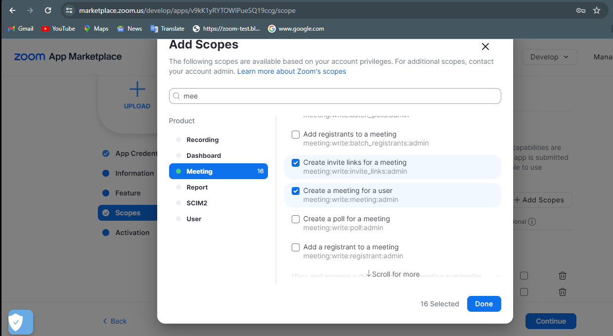
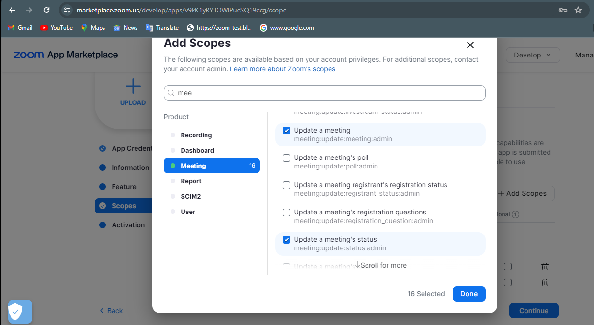
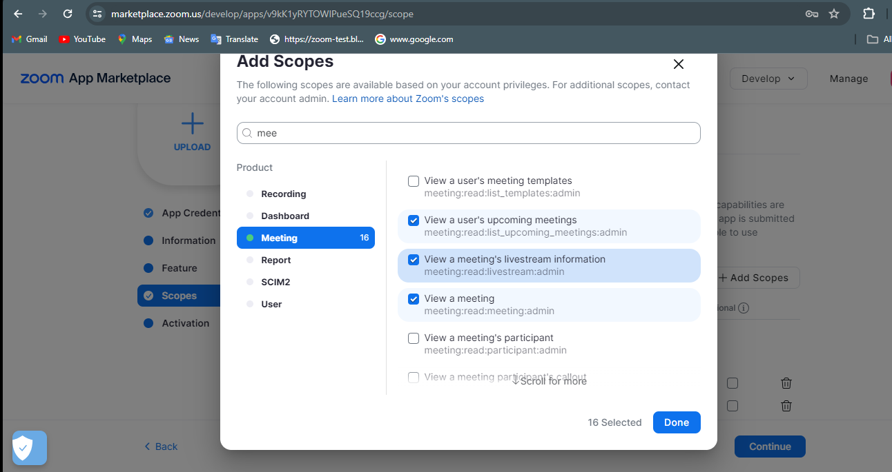

# LogiqueCode Zoom Crdentials Help Page
---

1. Click on the link to visit zoom market place and signIn over there. [Click Here](https://marketplace.zoom.us/)

2. Select **Build Server to Server App** from to right corner.

3. Provide a name to your app then click on create.

4. Now you will get to see **Account ID, Client ID and Client Secret.** Click on continue.

5. Fill out the basic details and then click on continue.

6. Click on continue and skip the feature option.

7. Click on **Add Scopes** to add meeting scope and then click on continue.

9. Click on **Activate Your App** to activate your app. Now move to app credentials and copy the zoom credentials.

